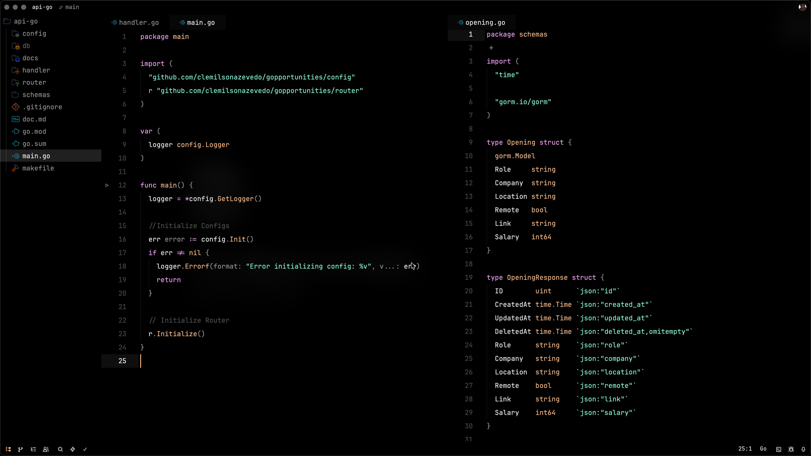
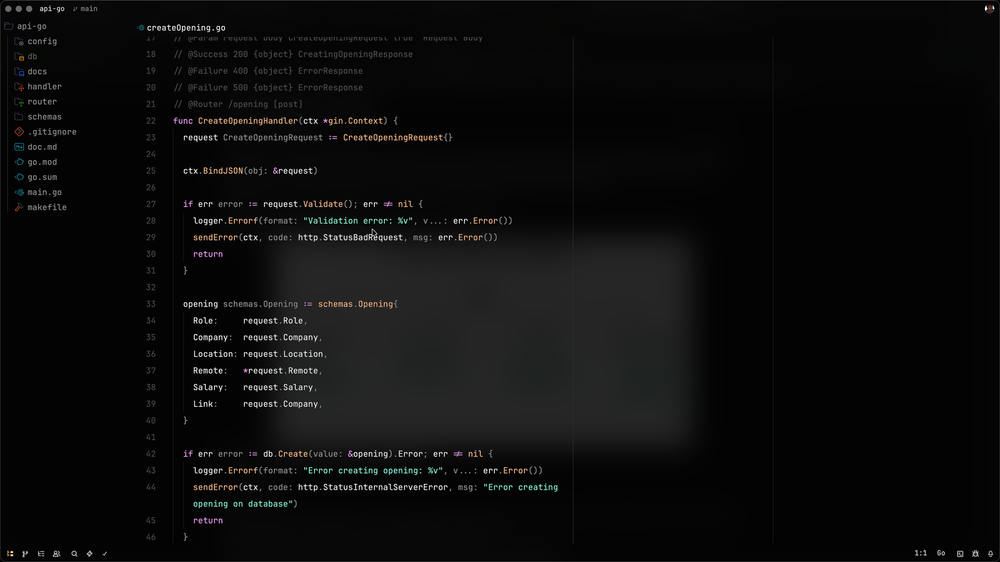

# Palanca Theme

A dark theme for Zed (and other editors), inspired by [Vesper](https://github.com/raunofreiberg/vesper).

## Screenshots





---

## Como instalar

Você pode instalar o Palanca de duas maneiras:

### 1) Pelo Marketplace (Extensões do Zed)

1. Abra o Zed.
2. Vá em: Zed → Extensions (ou abra a paleta de comandos e procure por “zed: extensions”).
3. Busque por “Palanca Theme”.
4. Clique em “Install”.
5. Aplique o tema: Settings → Themes → selecione “Palanca” (ou use o comando “Theme Selector: Toggle”).

Se o tema ainda não estiver publicado no Marketplace, use a instalação manual abaixo.

### 2) Instalação manual (copiando o JSON do tema)

Instalação manual via arquivo `.json` do tema. Crie a pasta de temas local do Zed e coloque o arquivo do Palanca lá.

Caminhos de temas locais:
- macOS e Linux: `~/.config/zed/themes`
- Windows: `%USERPROFILE%\AppData\Roaming\Zed\themes\`

Passo a passo:
1. Feche o Zed (se estiver aberto).
2. Crie a pasta de temas (se não existir):
   - macOS/Linux:
     ```bash
     mkdir -p ~/.config/zed/themes
     ```
   - Windows: crie a pasta `Zed\themes` dentro de `%USERPROFILE%\AppData\Roaming\` usando o Explorer.
3. Copie o JSON do tema Palanca para dentro dessa pasta:
   - Nome sugerido: `palanca.json`
   - Exemplo:  
     - macOS/Linux: `~/.config/zed/themes/palanca.json`  
     - Windows: `%USERPROFILE%\AppData\Roaming\Zed\themes\palanca.json`
4. Abra o Zed e selecione o tema:
   - Settings → Themes → escolha “Palanca”
   - Ou abra a paleta de comandos e use “Theme Selector: Toggle”.

Estrutura mínima do arquivo `palanca.json` (exemplo):
```json
{
  "name": "Palanca",
  "author": "Clemilson Azevedo",
  "accent": "#8b5cf6",
  "palette": {
    "background": "#0e0f12",
    "foreground": "#e5e7eb",
    "muted": "#9ca3af",
    "selection": "#1f2937",
    "cursor": "#e5e7eb"
  },
  "syntax": {
    "comment": { "color": "#6b7280", "font_style": "italic" },
    "string": { "color": "#22c55e" },
    "number": { "color": "#f59e0b" },
    "keyword": { "color": "#60a5fa", "font_style": "bold" },
    "function": { "color": "#a78bfa" },
    "variable": { "color": "#f472b6" },
    "type": { "color": "#38bdf8" },
    "constant": { "color": "#fb7185" }
  },
  "ui": {
    "panel.background": "#0b0c0f",
    "panel.border": "#1f2937",
    "editor.background": "#0e0f12",
    "editor.line_number": "#374151",
    "statusbar.background": "#0b0c0f",
    "tabbar.background": "#0b0c0f"
  }
}
```

Observações:
- O arquivo acima é um exemplo: ajuste cores e capturas conforme seu design.
- Depois de adicionar/alterar o JSON, reinicie o Zed para garantir que o tema apareça no seletor.

## Selecionando o tema rapidamente

Abra a paleta de comandos e execute:
- “Theme Selector: Toggle”
- Atalhos padrão:  
  - macOS: `Cmd + K`, depois `Cmd + T`  
  - Windows/Linux: `Ctrl + K`, depois `Ctrl + T`

Navegue pela lista, selecione “Palanca” e confirme com Enter.
